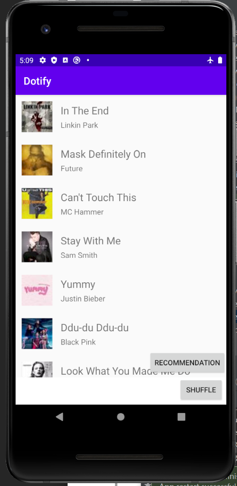
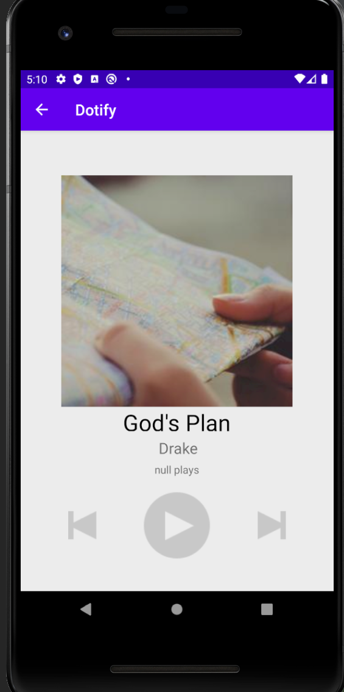

# Application, JSON parsing, HTTP REST calls
## Yuchen Wang

## Description:
  Dotify is an music player that enable users enjoys thousands of music with their Android smartphone. Dofity enables users to enjoy a list of music and to see detail information about each song. More than that, Dofity now support recommendation fucntion that will recommend songs based on user's preferrence from Internet. It will search songs that is similar to local list on Internet and show its detail information.

## Screenshot

  

